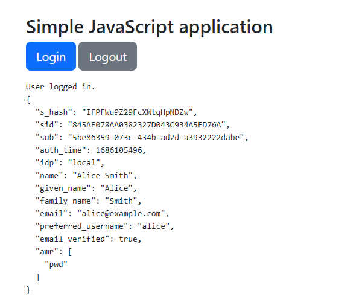

# Simple JavaScript application

Plain JavaScript application that sign users in using the OpenID Connect Core 1.0 Implicit Flow.

> When using the Implicit Flow, all tokens are returned from the Authorization Endpoint; the Token Endpoint is not used.

## Prerequisites

1. Node 14+

## Getting started

1. Clone this repository.
1. Change to `src/javascript` directory.
1. Run `npm install`.
1. Run `npm start`.
1. Open your web browser at `http://localhost:4000/index.html`.

## Captures

